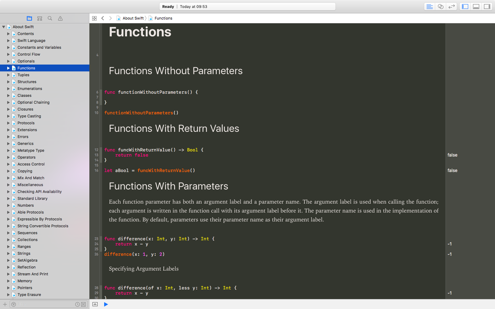

# About Swift

**This branch is often rebased, checkout `main` for a stable branch.**

### TODO
- SE-0414
- SE-0430
- SE-0434

### Contents
Explanations and samples about: 
* Swift Programming Language
* Swift Standard Library

### References
This playground is based mainly on: 
* [The Swift Programming Language Book](https://developer.apple.com/library/content/documentation/Swift/Conceptual/Swift_Programming_Language/index.html)
* [Swift Evolution](https://www.swift.org/swift-evolution)
* WWDC Videos
